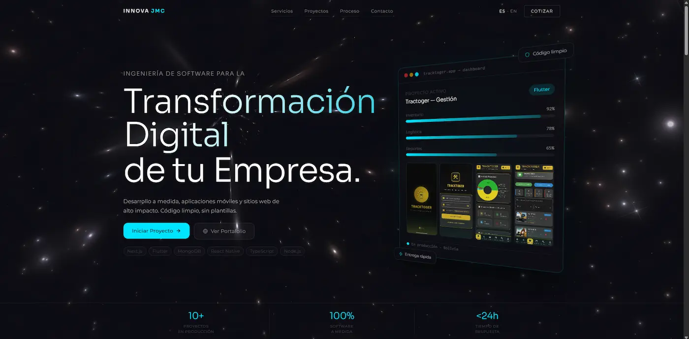
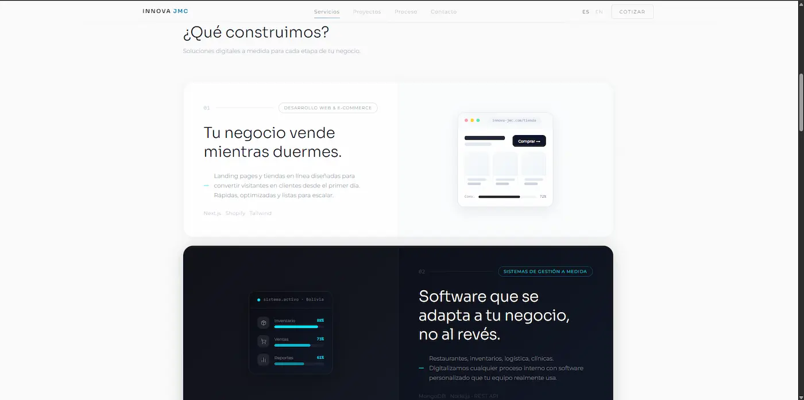
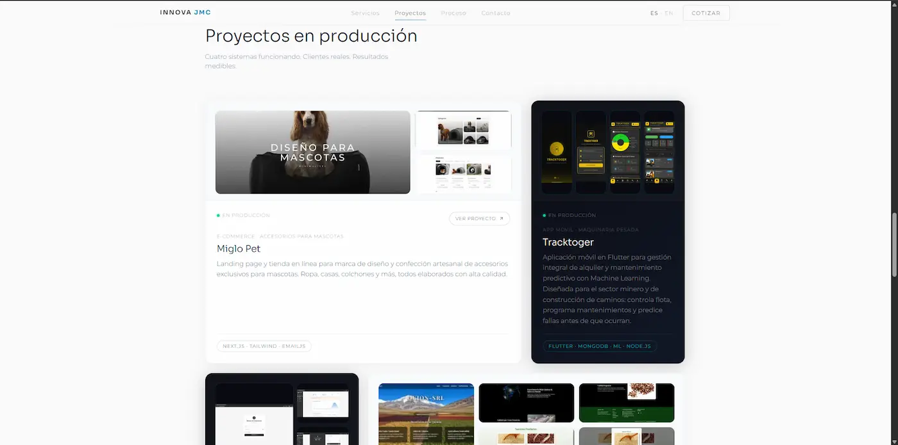
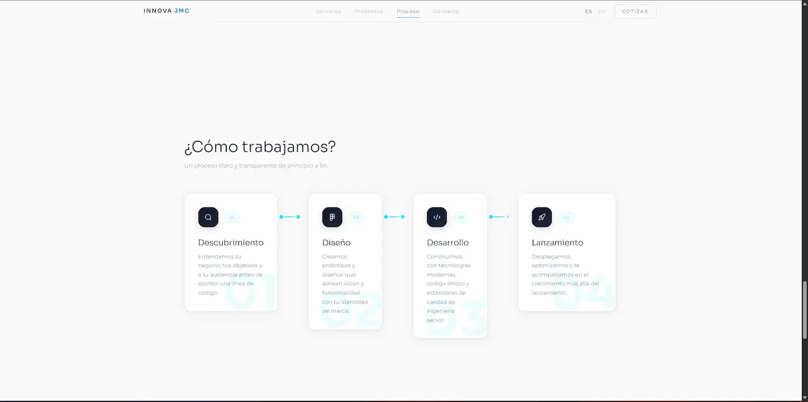
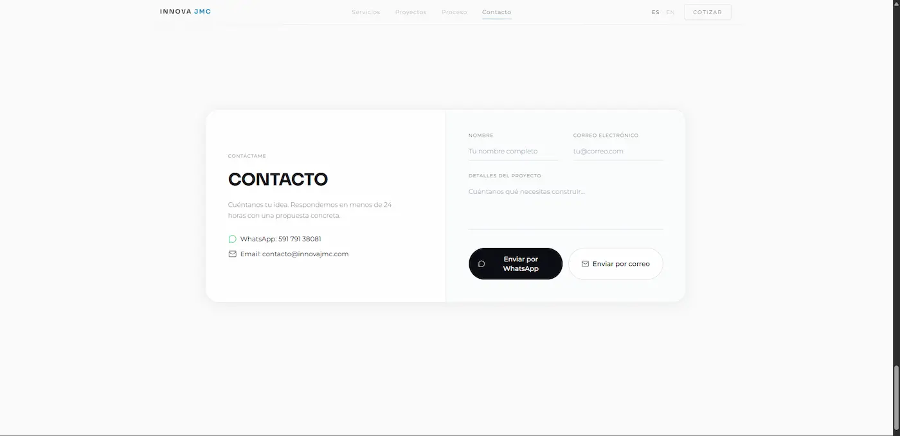

# Innova JMC Landing Page

Landing page corporativa para Innova JMC, enfocada en presentación de servicios, proyectos, proceso de trabajo y contacto rápido por WhatsApp/Email.

## Demo

- Repositorio público: [web-innovajmc](https://github.com/Poxi-JRMC/web-innovajmc.git)

## Tecnologías utilizadas

- Next.js 16 (App Router)
- React 19 + TypeScript
- Tailwind CSS v4
- Framer Motion
- next-intl (ES/EN)
- EmailJS
- Lucide React

## Capturas

> Las imágenes deben estar en `public/inova/`.

### Home


### Servicios


### Proyectos


### Proceso


### Contacto


## Estructura clave

- `src/components/` -> Secciones UI (Hero, Services, Projects, Process, Contact, Footer)
- `src/app/[locale]/` -> Rutas internacionales
- `messages/` -> Traducciones ES/EN
- `public/inova/` -> Capturas para README

## Ejecución local

```bash
npm install
npm run dev
```

Abrir en: [http://localhost:3000](http://localhost:3000)
